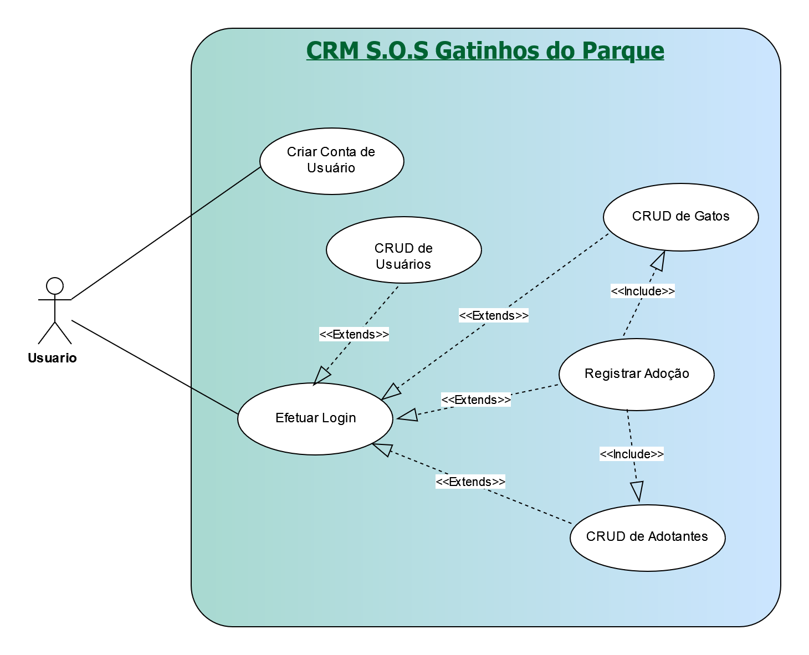

# 2. Especificações do Projeto

No projeto de Gerenciamento de Relacionamento com o Cliente (CRM), serão utilizadas tecnologias específicas para criar a solução. Além disso, serão aplicadas técnicas relevantes para garantir que o sistema atenda às necessidades dos usuários. Aqui estão as tecnologias e técnicas:

## 2.1 Tecnologias Utilizadas

1. **Node.js (Backend):** O backend será desenvolvido utilizando Node.js, que é uma plataforma de código aberto que permite a criação de aplicativos de rede escaláveis e de alto desempenho. Isso permitirá a criação de APIs RESTful (com Node.js e Express.js) para gerenciar os dados dos gatos, adoções e outros aspectos do sistema, e com foco na segurança e nas integrações flexíveis.

2. **React.js (Frontend):** O frontend do sistema será construído com React.js, uma biblioteca JavaScript de código aberto para construir interfaces de usuário. O React.js permitirá a criação de uma interface intuitiva e responsiva para os usuários, enfatizando a componentização, o gerenciamento de estado e a responsividade.

3. **MongoDB (Banco de Dados):** O MongoDB, um banco de dados NoSQL caracterizado por um esquema flexível, índices eficientes e medidas de segurança, será utilizado para armazenar os dados do sistema. Sua natureza flexível permite que os dados dos gatos, adoções e outras informações sejam armazenados de forma eficiente.

Essas tecnologias modernas garantirão um sistema de CRM eficiente, escalável e seguro.

## 2.2 Técnicas a serem Aplicadas

1. **APIs RESTful:** Para o desenvolvimento do backend, serão implementadas APIs RESTful, que seguirão princípios de arquitetura REST para facilitar a interação entre o frontend e o banco de dados. Isso proporcionará uma comunicação eficaz e padronizada.

2. **Segurança e Autenticação:** Técnicas de segurança, como proteção contra injeção de SQL e autenticação de usuários, serão implementadas para garantir a integridade e a confidencialidade dos dados dos adotantes e dos gatos.

3. **Desenvolvimento Ágil:** Será adotada uma abordagem de desenvolvimento ágil, como o Scrum ou o Kanban, para permitir atualizações frequentes e aprimoramentos com base no feedback dos usuários.

4. **Usabilidade:** A interface do usuário será projetada seguindo princípios de usabilidade, garantindo que seja intuitiva e de fácil uso para que os usuários se adaptem rapidamente.

5. **Desempenho:** Para otimizar o desempenho, técnicas de otimização de consultas ao banco de dados e de cache serão aplicadas, garantindo que o sistema responda rapidamente às solicitações dos usuários.

6. **Privacidade e Conformidade:** Serão implementadas medidas de segurança para proteger as informações pessoais dos adotantes, garantindo conformidade com regulamentações de privacidade de dados, como o GDPR.

7. **Escalabilidade:** A arquitetura será projetada para ser escalável, permitindo que o sistema lide com um grande volume de registros de gatos e adoções à medida que o projeto cresce.

8. **Atualizações e Melhorias Contínuas:** Será estabelecido um ciclo contínuo de atualizações e melhorias com base no feedback dos usuários, garantindo que o sistema evolua para atender às necessidades em constante mudança.

Essas tecnologias e técnicas serão fundamentais para o desenvolvimento e o sucesso do projeto de Gerenciamento de Relacionamento com o Cliente (CRM), proporcionando uma solução eficiente, segura e adaptável às necessidades dos usuários e do mercado.

## 2.3 Arquitetura

A arquitetura de solução apresenta como o software é estruturado em termos dos componentes que fazem parte da solução e do ambiente de hospedagem da aplicação. Seguem abaixo os principais elementos relacionados a esse tópico.

### 2.3.1 Diagrama de Componentes

Compreendemos nessa seção os componentes que fazem parte da arquitetura da solução, consoante figura adiante.

Figura 1 - Arquitetura da Solução

Fonte: Elaborado pelos Autores

## 2.4 _Project Model Canvas_

O _Project Model Canvas_ é uma representação visual que geralmente é dividida em seções, cada uma das quais aborda um aspecto fundamental do projeto.

Figura 2 - Project Model Canvas

Fonte: Elaborado pelos Autores

## 2.5 Requisitos para o Sistema de Gerenciamento de Adoção de Gatos

Neste documento, são apresentados os requisitos funcionais e não funcionais para o desenvolvimento do Sistema de Gerenciamento de Adoção de Gatos. O sistema tem como objetivo facilitar o registro, acompanhamento e gerenciamento de adoções de gatos, fornecendo uma plataforma eficaz e segura para conectar adotantes a gatos disponíveis para adoção. Os requisitos foram divididos em categorias de funcionalidades e características para garantir que o sistema atenda às necessidades dos usuários de maneira abrangente e eficiente.

As tabelas que se seguem apresentam os requisitos funcionais e não funcionais que detalham o escopo do projeto, para determinar a prioridade de requisitos, aplicar uma técnica de priorização de requisitos e detalhar como a técnica foi aplicada.

### 2.5.1 Requisitos Funcionais

Apresenta-se a seguir os requisitos funcionais que o projeto deverá atender.

Quadro 1 - Requisitos Funcionais

| ID     | Descrição do Requisito                                                                                                                                                                                                                                                                                                                                                                                                                              | Prioridade |
|--------|-----------------------------------------------------------------------------------------------------------------------------------------------------------------------------------------------------------------------------------------------------------------------------------------------------------------------------------------------------------------------------------------------------------------------------------------------------|-----------|
| RF-001 | Registro de Gatos: Permitir o cadastro do chip do gato, incluindo um número único para identificação. Capturar informações como nome, foto, status FIV, status FeLV, status da castração e características físicas e comportamentais do gato. Registrar a data de entrada do gato no sistema. Disponibilizar campo para adicionar em qual ponto do parque o gato foi localizado.                                                                    | ALTA      | 
| RF-002 | Registro de Adoção: Registrar a data de adoção do gato. Capturar informações do adotante, incluindo Nome do Adotante, Endereço Residencial, Bairro, Cidade/Estado, CEP, RG, CPF, Profissão, Estado Civil, Fone Fixo, Fone Celular, e-mail obrigatório do adotante. Associar o gato ao adotante correspondente. Registrar o status do acompanhamento com o adotante (a fazer, contato feito, foto enviada, foto não enviada/enviada incorretamente). | ALTA      |
| RF-003 | Edição do gato: Possibilitar a edição de todas as informações do gato, incluindo Nome do Animal, Raça, Idade, Espécie (Canina/Felina), Cor da Pelagem, Sexo, Vacinado, Porte (indicar somente caninos), Castrado, Vermifugado nos últimos 3 meses, Observações, e Endereço onde ficará o animal. Permitir a atualização dos dados do adotante, como telefone, endereço e e-mail.                                                             | ALTA      | 
| RF-004 | Edição da adoção: Editar todos os dados da adoção.    |ALTA      | 
| RF-005 | Excluir Adoção: Exclui adoção de forma facil e sempre perguntar se tem certeza antes de excluir. | MÉDIA      | 
| RF-006 | Registro de Adotantes:  Registar todos os dados do adotante       |MÉDIA      | 
| RF-007 | Editar Adotantes:  Editar todos os dados do adotante       |MÉDIA      | 
| RF-008 | Registro de usuarios :  Registar todos os dados do usuario          |Alta      | 
| RF-009 | Editar usuarios:  Editar todos os dados do usuario       |MÉDIA      | 
| RF-010 | Excluir usuarios:  Excluir usuarios     |MÉDIA      | 
| RF-011 | Relatorio: Gerar relatorios em todos os data grids    |MÉDIA      | 

Fonte: Elaborado pelos autores

### 2.5.2 Requisitos Não Funcionais

Apresenta-se a seguir os requisitos não funcionais que o projeto deverá atender.

Quadro 2 - Requisitos Não Funcionais

| ID      | Descrição do Requisito  |Prioridade |
|---------|-------------------------|-----------|
| RNF-001 | Usabilidade: A interface deve ser intuitiva e fácil de usar, permitindo que os usuários se adaptem rapidamente. A interface deve destacar à primeira vista a foto, nome, status de saúde e status de adoção do gato.	| MÉDIA | 
| RNF-002 | Performance: O sistema deve responder rapidamente durante a busca e exibição de informações dos gatos e adotantes.	|  ALTA | 
| RNF-003 | Segurança e Privacidade: As informações pessoais dos adotantes devem ser armazenadas de forma segura e confidencial. Apenas usuários autorizados devem ter acesso ao sistema.	|  ALTA | 
| RNF-004 | Escalabilidade: O sistema deve ser capaz de lidar com um grande número de registros de gatos e adotantes, considerando o volume significativo de adoções.	|  ALTA | 
| RNF-005 | Personalização: Permitir a edição e personalização dos perfis de gatos com imagens e características únicas.	|  MÉDIA | 
| RNF-006 | Disponibilidade: Garantir que o sistema esteja disponível a maior parte do tempo, uma vez que os usuários poderão acessá-lo em diferentes momentos.	 |  BAIXA | 
| RNF-007 | Atualização: Deve ser possível realizar atualizações frequentes no sistema para adicionar recursos adicionais e melhorias com base no _feedback_ dos usuários.|  MÉDIA | 

Fonte: Elaborado pelos autores

## 2.6 Restrições

Neste documento, apresenta-se as restrições que guiarão o processo de desenvolvimento do sistema de Gerenciamento de Relacionamento com o Cliente (CRM) utilizando as tecnologias _Node.js, React.js e MongoDB_. Essas restrições garantirão a segurança, desempenho, escalabilidade e conformidade do sistema, enquanto aproveitam as vantagens dessas tecnologias modernas e poderosas.

### 2.6.1 _Node.js (Backend)_

Quadro 3 - _Node.js_

|ID   | Considerações                                         | Descrição |
|-----|-------------------------------------------------------|-----------|
|RE 01| APIs RESTful | Utilize o _Node.js_ para criar _APIs RESTful_ que gerenciem as interações entre o frontend e o banco de dados.          |
|RE 02| Express.js	 | Considere usar o _framework Express.js_ para facilitar o desenvolvimento do servidor e das rotas da _API_.              |
|RE 03| Segurança	   | Implemente práticas de segurança como proteção contra injeção de SQL, autenticação e autorização.                       |
|RE 04| Integrações  | Aproveite a flexibilidade do _Node.js_ para integrar _APIs_ de terceiros, como serviços de pagamento ou geolocalização. |

Fonte: Elaborado pelos autores

### 2.6.2 _React.js (Frontend)_

Quadro 4 - _React.js_

|ID   | Considerações     | Descrição |
|-----|-------------------|-----------|
|RE 01| Componentização   | Divida a interface em componentes independentes para facilitar o desenvolvimento e manutenção. |
|RE 02| State Management	| Use Redux ou Context API para gerenciar o estado global e compartilhar dados entre componentes.|
|RE 03| Roteamento	      | Utilize uma biblioteca de roteamento como o React Router para criar uma navegação fluida.      |
|RE 04| Estilização	      | Considere usar styled-components ou CSS Modules para criar estilos de forma modular.           |
|RE 05| Responsividade  	|	Garanta que a interface seja responsiva para acessos em dispositivos móveis e desktops.        |

Fonte: Elaborado pelos autores

### 2.6.3 _MongoDB_ (Banco de Dados)

Quadro 5 - _MongoDB_

|ID   | Considerações          | Descrição |
|-----|------------------------|-----------|
|RE 01| NoSQL Database	       | O MongoDB é um banco de dados NoSQL, portanto, planeje o design do banco de dados de acordo com essa estrutura.                     |
|RE 02| Esquema Flexível		   | Aproveite o esquema flexível do MongoDB para adaptar-se às mudanças nos requisitos sem alterar a estrutura do banco de dados.       |
|RE 03| Índices Eficientes     | Configure índices apropriados para melhorar o desempenho das consultas e pesquisas.                                                 |
|RE 04| Gerenciamento de Dados | Considere estratégias para o gerenciamento de dados, como a exclusão de registros antigos ou a compactação do banco.                |
|RE 04| Segurança              | Configure autenticação e controle de acesso adequados ao MongoDB para proteger seus dados.                                          |
|RE 04| Backup e Restauração	 | Implemente rotinas de backup regulares e teste procedimentos de restauração para garantir a recuperação de dados em caso de falhas. |

Fonte: Elaborado pelos autores

## 2.7 Diagrama de Casos de Uso

O diagrama de caso de uso, comumente oriundo da especificação dos requisitos funcionais do sistema, descreve as principais funcionalidades do sistema que será projetado pelo grupo e sua interação com os possíveis usuários (DevMedia, 2022). Segundo Ivar Jacobson, podemos dizer que um caso de uso é um "documento narrativo que descreve a sequência de eventos de um ator que usa um sistema para completar um processo" (Wikipédia, 2020).

Graficamente é representado com elementos como os atores, os casos de uso e seus relacionamentos entre si. Seu objetivo principal é ilustrar de forma abstrata, a interação dos elementos externos com as funcionalidades do sistema, ou seja, “a finalidade de um diagrama de caso de uso é apresentar um tipo de diagrama de contexto que apresenta os elementos externos de um sistema e as maneiras segundo as quais eles as utilizam” (Wikipédia, 2020).

Desta feita, o grupo representa abaixo o diagrama de caso de uso para o sistema que será projetado.

Figura 3 - Diagrama de Casos de Uso

Fonte: Elaborado pelos autores

## 2.8 Modelo de Dados

O Modelo de dados escolhido foi o NoSQL do tipo documento. Esse modelo foi definido pensando no grande volume de dados demandados pela aplicação. Segue abaixo a representação do Modelo:

Figura 4 - Modelagem de Dados

Fonte: Elaborado pelos autores

Também pode ser acessado clicando <a href="https://lucid.app/lucidchart/81243027-bc05-48b8-bc63-2d3e55851eec/edit?viewport_loc=191%2C-182%2C1623%2C865%2C0_0&invitationId=inv_23f15e69-f1ff-408f-b004-d341a9c271b5">aqui</a>.

## 2.7 Projeto da Base de Dados

De acordo com DevMedia (2023), Banco de Dados Orientados a Documentos tem como característica abranger as informações cruciais em um único documento, não possuir esquemas, conter identificadores únicos universais (UUID), proporcionar a consulta de documentos através de métodos avançados de agrupamento e filtragem e também permitir redundância e inconsistência.

Pelos motivos elencados acima, o grupo optou por utilizar o MongoDb, além de tornar a leitura e gravação de dados rápida e eficiente durante a análise de informações em tempo real e em diversos ambientes de desenvolvimento. (IBM, 2023)

